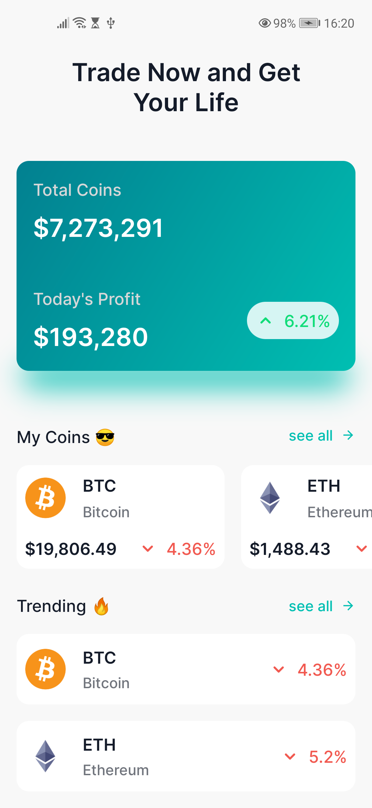
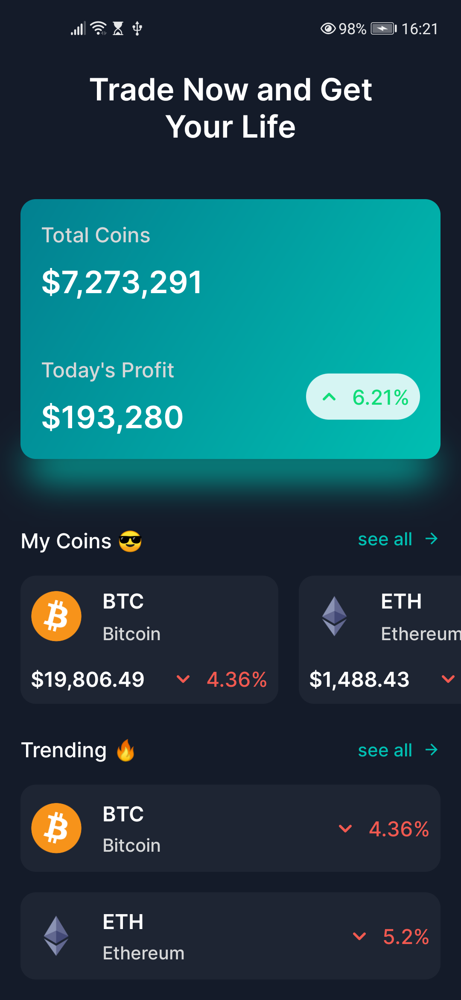
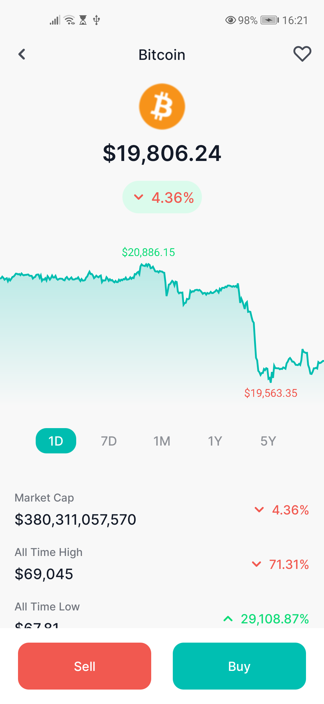
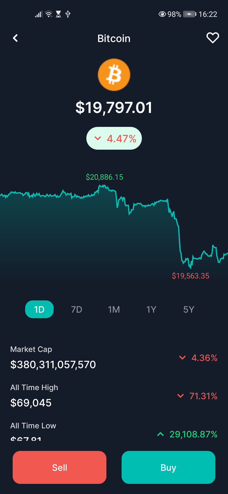

# Jetpack Compose Crypto

This is an sample Crypto market prices app built with Jetpack Compose

### Screenshot 📸

|       | Light | Dark |
|-------|------|--------|
| Home |  |  |
| Detail  |  |  |

https://user-images.githubusercontent.com/6950766/200531814-dc492b81-32ff-4e82-bbe0-c12b18b38bad.mp4

### References:
- [Coingecko API](https://www.coingecko.com/en/api/documentation)
- [Figma Design](https://www.figma.com/community/file/1108313912145052181)
- [App launcher - Free icon](https://www.flaticon.com/free-icon/project_1055646?related_id=1055646)

## Usage

Clone the repository

`git clone git@github.com:nimblehq/jetpack-compose-crypto.git`

## License

This project is Copyright (c) 2014 and onwards. It is free software,
and may be redistributed under the terms specified in the [LICENSE] file.

[LICENSE]: /LICENSE

## About

<a href="https://nimblehq.co/">
  <picture>
    <source media="(prefers-color-scheme: dark)" srcset="https://assets.nimblehq.co/logo/dark/logo-dark-text-160.png">
    
  </picture>
</a>

This project is maintained and funded by Nimble.

We love open source and do our part in sharing our work with the community!
See [our other projects][community] or [hire our team][hire] to help build your product.

[community]: https://github.com/nimblehq
[hire]: https://nimblehq.co/
